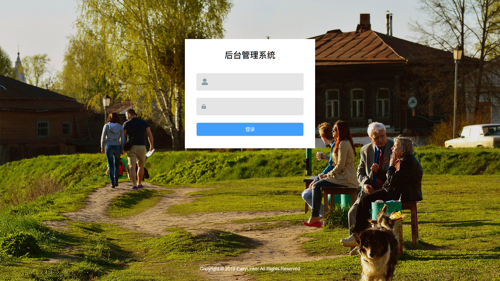
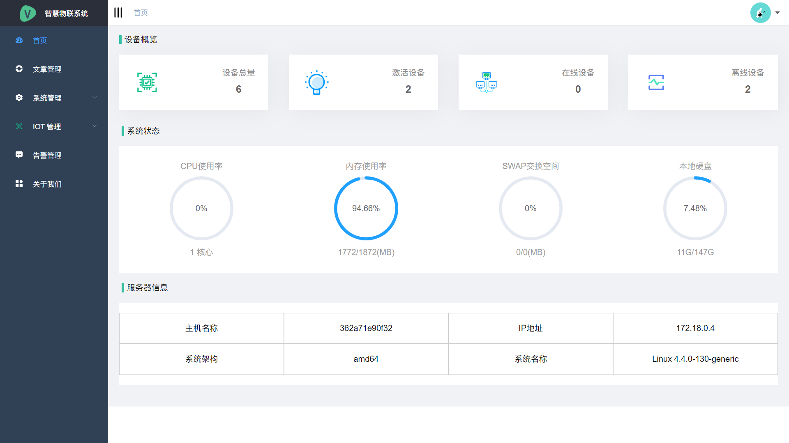
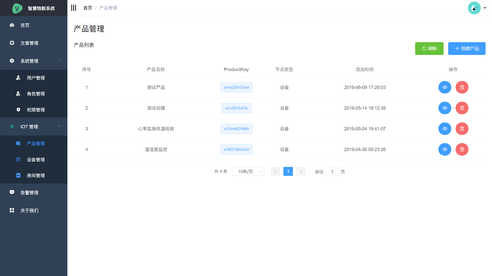
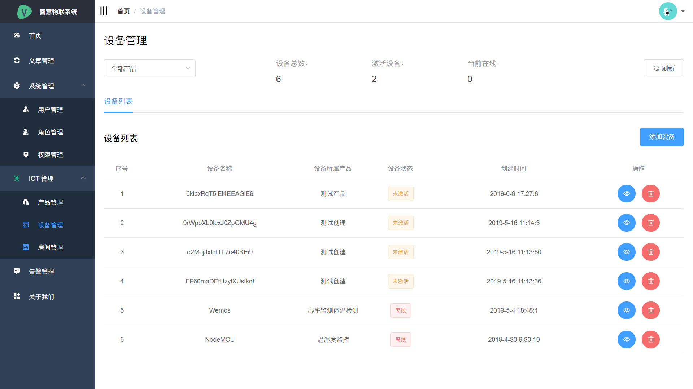
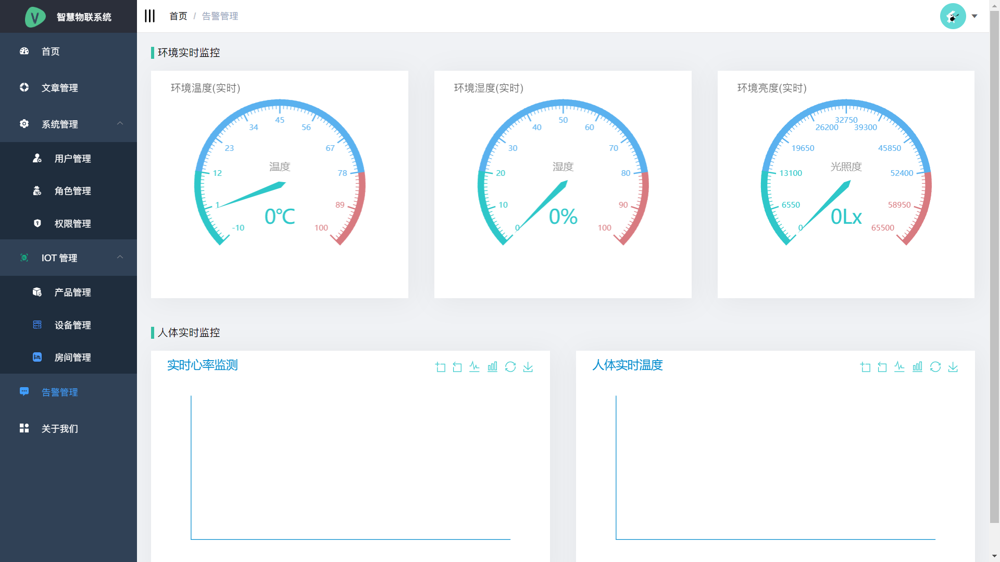

# iot-aliyuniot-demo

基于 AliyunIOt 的物联网演示项目

### 项目技术栈

#### 1.后端

| 序号 |     名称      |  版本  |
| :--: | :-----------: | :----: |
|  1   |  SpringBoot   | 2.1.0  |
|  2   |   fastjson    | 1.2.54 |
|  3   |  tk.mybatis   | 2.1.3  |
|  4   |  pagehelper   | 1.2.10 |
|  5   |     shiro     | 1.4.0  |
|  6   | commons-lang3 | 3.8.1  |
|  7   |     druid     | 1.1.10 |
|  8   |    lombok     | 1.18.6 |
|  9   |     sigar     | 1.6.4  |
|  10  |    jasypt     | 2.1.1  |

...其他依赖

#### 2.前端

| 序号 |    名称    |  版本  |
| :--: | :--------: | :----: |
|  1   |   axios    | 0.17.1 |
|  2   |  echarts   | 4.2.1  |
|  3   | element-ui | 2.3.4  |
|  4   | js-cookie  | 2.2.0  |
|  5   |  stompjs   | 2.3.3  |
|  6   |    vue     | 2.5.10 |
|  7   | vue-router | 3.0.1  |
|  8   |    vuex    | 3.0.1  |

...其他依赖

### 前端截图展示

1.登录页
 2.首页
 3.产品管理
 4.设备管理
 5.告警管理

### 更多技术详情请扫码加群交流

